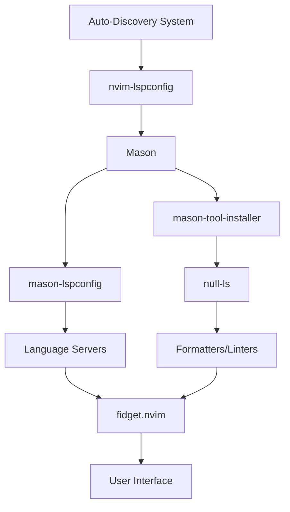

# LSP Configuration Documentation

This document explains how to add, configure, and manage Language Server Protocol (LSP) configurations in this Neovim setup.

## Currently Configured Language Servers

This Neovim configuration includes the following language servers:

### Core Language Servers
- **lua_ls** - Official Lua language server with Neovim-specific configuration
- **pylsp** - Python LSP Server with disabled plugins (using Ruff instead)
- **ruff** - Fast Python linter and formatter with custom commands

### Basic Language Servers
- **jsonls** - JSON language server
- **yamlls** - YAML language server
- **terraformls** - Terraform language server
- **dockerls** - Docker language server
- **docker_compose_language_service** - Docker Compose language server
- **bashls** - Bash language server
- **sqlls** - SQL language server

### Additional Tools
- **stylua** - Lua code formatter (installed via Mason)

### Available but Disabled
The following servers are available but currently commented out in `basic-lsp.lua`:
- **html** - HTML language server
- **cssls** - CSS language server
- **tailwindcss** - Tailwind CSS language server
- **graphql** - GraphQL language server
- **ltex** - LaTeX language server
- **texlab** - LaTeX language server

## Directory Structure

```
lua/core/lsp/
├── init.lua              # Auto-discovery loader
├── lua-lsp.lua           # Lua language server
├── python-lsp.lua        # Python servers (pylsp + ruff)
└── basic-lsp.lua         # All simple servers
```

## How the Auto-Discovery System Works

The LSP system uses **true auto-discovery** - it automatically finds and loads all `.lua` files in the `lua/core/lsp/` directory (excluding `init.lua`). This means:

- No hardcoded file lists to maintain
- Just create a file and it's automatically loaded
- Error-resilient (skips broken files)
- Future-proof (works with any number of servers)

### Deep Dive: Auto-Discovery Code Analysis

The auto-discovery system is implemented in `lua/core/lsp/init.lua`. Here's how it works:

#### 1. File Discovery
```lua
-- Get the Neovim config directory path
local lsp_dir = vim.fn.stdpath('config') .. '/lua/core/lsp'

-- Use globpath to find all .lua files in the directory
-- Parameters: directory, pattern, escape, return_list
local files = vim.fn.globpath(lsp_dir, '*.lua', false, true)
```

**Why this works:**
- `vim.fn.stdpath('config')` returns the Neovim config directory (e.g., `~/.config/nvim`)
- `vim.fn.globpath()` is a built-in Neovim function that finds files matching a pattern
- The pattern `'*.lua'` matches all Lua files
- `false` means don't escape special characters
- `true` means return a list of files instead of a single string

#### 2. File Processing Loop
```lua
for _, file in ipairs(files) do
  -- Extract filename without extension
  local filename = vim.fn.fnamemodify(file, ':t:r')
  
  -- Skip init.lua to prevent infinite recursion
  if filename ~= 'init' then
    -- Safely require the module
    local ok, config = pcall(require, 'core.lsp.' .. filename)
    
    if ok and config then
      -- Merge configurations into servers table
      for server_name, server_config in pairs(config) do
        servers[server_name] = server_config
      end
    end
  end
end
```

**Why this works:**
- `vim.fn.fnamemodify(file, ':t:r')` extracts just the filename without path and extension
- `pcall()` safely calls `require()` and catches any errors
- The `require('core.lsp.' .. filename)` dynamically loads each file
- `pairs()` iterates over the returned configuration table
- Each server configuration is merged into the main `servers` table

#### 3. Error Handling
```lua
local ok, config = pcall(require, 'core.lsp.' .. filename)
if ok and config then
  -- Process configuration
else
  -- Silently skip files that don't exist or have errors
  -- This allows for optional language configurations
end
```

**Why this works:**
- `pcall()` returns `true` if the function succeeds, `false` if it fails
- If `ok` is `false`, the file is silently skipped
- This makes the system resilient to missing or broken files
- You can have optional language configurations without breaking the system

## Plugins That Power the LSP System

The LSP system relies on several key plugins that work together to provide a complete language server experience:

### Core LSP Plugins

#### 1. **nvim-lspconfig** (`neovim/nvim-lspconfig`)
**Purpose:** The foundation of the LSP system - provides configurations for 100+ language servers.

**How it works:**
```lua
-- In lua/plugins/lsp.lua
return {
  'neovim/nvim-lspconfig',
  -- ... dependencies
}
```

**Key features:**
- Pre-configured settings for popular language servers
- Automatic server setup and management
- Integration with Neovim's built-in LSP client
- Handles server lifecycle (start/stop/restart)

#### 2. **Mason** (`williamboman/mason.nvim`)
**Purpose:** Package manager for LSP servers, DAP servers, linters, and formatters.

**How it works:**
```lua
-- Automatically installs language servers
require('mason').setup()

-- Install specific tools
require('mason-tool-installer').setup {
  ensure_installed = { 'lua_ls', 'pylsp', 'ruff' }
}
```

**Key features:**
- Downloads and installs language servers automatically
- Manages server versions and updates
- Works across different operating systems
- Integrates with nvim-lspconfig

#### 3. **mason-lspconfig** (`williamboman/mason-lspconfig.nvim`)
**Purpose:** Bridge between Mason and nvim-lspconfig - automatically configures installed servers.

**How it works:**
```lua
require('mason-lspconfig').setup {
  handlers = {
    function(server_name)
      local server = servers[server_name] or {}
      server.capabilities = vim.tbl_deep_extend('force', {}, capabilities, server.capabilities or {})
      require('lspconfig')[server_name].setup(server)
    end,
  },
}
```

**Key features:**
- Automatically sets up servers installed by Mason
- Merges custom configurations with default settings
- Handles server capabilities and settings
- Provides a unified configuration interface

#### 4. **mason-tool-installer** (`WhoIsSethDaniel/mason-tool-installer.nvim`)
**Purpose:** Automatically installs additional tools (formatters, linters) via Mason.

**How it works:**
```lua
require('mason-tool-installer').setup {
  ensure_installed = {
    'stylua', -- Lua formatter
    'prettier', -- Web formatter
    'eslint_d', -- JavaScript linter
  }
}
```

**Key features:**
- Installs formatters and linters automatically
- Ensures tools are available for null-ls
- Manages tool versions and updates
- Integrates with the LSP ecosystem

### Supporting Plugins

#### 5. **fidget.nvim** (`j-hui/fidget.nvim`)
**Purpose:** Shows LSP progress and status updates in a clean UI.

**Configuration:**
```lua
{
  'j-hui/fidget.nvim',
  opts = {
    progress = {
      display = {
        done_icon = '✓',
      },
    },
    notification = {
      window = {
        winblend = 0,
      },
    },
  },
}
```

**Key features:**
- Shows LSP initialization progress
- Displays server status and errors
- Clean, non-intrusive UI
- Real-time feedback for LSP operations

#### 6. **null-ls** (`nvimtools/none-ls.nvim`)
**Purpose:** Provides LSP-like features for tools that aren't language servers (formatters, linters).

**How it works:**
```lua
-- In lua/plugins/none-ls.lua
local null_ls = require 'null-ls'
local formatting = null_ls.builtins.formatting
local diagnostics = null_ls.builtins.diagnostics

null_ls.setup {
  sources = {
    formatting.stylua, -- Lua formatter
    formatting.prettier, -- Web formatter
    diagnostics.eslint_d, -- JavaScript linter
  },
}
```

**Key features:**
- Integrates formatters and linters as LSP-like services
- Provides code actions and diagnostics
- Works with tools that don't have LSP implementations
- Seamless integration with the LSP ecosystem

### How All Plugins Work Together



**The complete flow:**
1. **Auto-discovery** finds all LSP configuration files
2. **nvim-lspconfig** provides the LSP framework
3. **Mason** installs language servers and tools
4. **mason-lspconfig** bridges Mason and nvim-lspconfig
5. **mason-tool-installer** installs additional tools
6. **null-ls** integrates non-LSP tools
7. **fidget.nvim** shows progress and status

## Complete Initialization Flow

Understanding how the LSP system initializes helps explain why everything works seamlessly:

### 1. Plugin Loading (init.lua)
```lua
-- init.lua loads the LSP plugin
require 'plugins.lsp'
```

### 2. LSP Plugin Setup (lua/plugins/lsp.lua)
```lua
return {
  'neovim/nvim-lspconfig',
  dependencies = {
    'williamboman/mason.nvim',
    'williamboman/mason-lspconfig.nvim',
    'WhoIsSethDaniel/mason-tool-installer.nvim',
    'j-hui/fidget.nvim',
  },
  config = function()
    -- LSP setup code here
  end,
}
```

### 3. Auto-Discovery Execution
```lua
-- Inside the config function
local lsp_config = require('core.lsp')
local servers = lsp_config.get_servers()
```

**What happens:**
1. `require('core.lsp')` loads our auto-discovery module
2. `get_servers()` scans the `lua/core/lsp/` directory
3. Each `.lua` file is dynamically loaded with `require()`
4. All server configurations are merged into a single table

### 4. Mason Installation
```lua
require('mason').setup()

local ensure_installed = vim.tbl_keys(servers or {})
local additional_tools = lsp_config.get_additional_tools()
vim.list_extend(ensure_installed, additional_tools)
require('mason-tool-installer').setup { ensure_installed = ensure_installed }
```

**What happens:**
1. Mason initializes its package manager
2. Server names are extracted from our configurations
3. Additional tools (like formatters) are added
4. Mason installs all required language servers and tools

### 5. LSP Server Configuration
```lua
require('mason-lspconfig').setup {
  handlers = {
    function(server_name)
      local server = servers[server_name] or {}
      server.capabilities = vim.tbl_deep_extend('force', {}, capabilities, server.capabilities or {})
      require('lspconfig')[server_name].setup(server)
    end,
  },
}
```

**What happens:**
1. For each installed server, the handler function is called
2. Custom configuration is merged with default settings
3. Server capabilities are enhanced with completion support
4. The server is configured and started

### 6. Key Mappings and Autocommands
```lua
vim.api.nvim_create_autocmd('LspAttach', {
  group = vim.api.nvim_create_augroup('lsp-attach', { clear = true }),
  callback = function(event)
    -- Set up key mappings for LSP functions
    local map = function(keys, func, desc)
      vim.keymap.set('n', keys, func, { buffer = event.buf, desc = 'LSP: ' .. desc })
    end
    
    map('gd', require('telescope.builtin').lsp_definitions, '[G]oto [D]efinition')
    map('gr', require('telescope.builtin').lsp_references, '[G]oto [R]eferences')
    -- ... more mappings
  end,
})
```

**What happens:**
1. When an LSP server attaches to a buffer, this autocmd fires
2. Key mappings are set up for LSP functions (goto definition, references, etc.)
3. Document highlighting and other LSP features are enabled
4. The setup is specific to each buffer that gets LSP support

### 7. The Complete Picture

```lua
-- This is what happens when you open a Lua file:

-- 1. Auto-discovery finds lua-lsp.lua
-- 2. lua-lsp.lua returns: { lua_ls = { settings = {...} } }
-- 3. Mason installs lua_ls if not already installed
-- 4. mason-lspconfig configures lua_ls with our custom settings
-- 5. LspAttach autocmd fires when lua_ls attaches to the buffer
-- 6. Key mappings and features are enabled
-- 7. You get full Lua language support with custom configuration
```

## Adding New Language Servers

### Method 1: Simple Servers (Recommended for most cases)

For language servers that work well with default settings, add them to `basic-lsp.lua`:

```lua
-- lua/core/lsp/basic-lsp.lua
return {
  -- Existing servers...
  jsonls = {},
  yamlls = {},
  
  -- Add your new server here:
  tsserver = {},
  html = { filetypes = { 'html', 'twig', 'hbs' } },
  cssls = {},
}
```

### Method 2: Complex Servers (Custom configuration needed)

For servers requiring special settings, create a dedicated file:

```lua
-- lua/core/lsp/typescript-lsp.lua
return {
  tsserver = {
    settings = {
      typescript = {
        preferences = {
          includeInlayParameterNameHints = 'all',
          includeInlayParameterNameHintsWhenArgumentMatchesName = false,
          includeInlayFunctionParameterTypeHints = true,
          includeInlayVariableTypeHints = true,
          includeInlayPropertyDeclarationTypeHints = true,
          includeInlayFunctionLikeReturnTypeHints = true,
          includeInlayEnumMemberValueHints = true,
        },
      },
    },
    commands = {
      TSServerOrganizeImports = {
        function()
          vim.lsp.buf.execute_command {
            command = 'typescript.organizeImports',
            arguments = { vim.uri_from_bufnr(0) },
          }
        end,
        description = 'TypeScript: Organize imports',
      },
    },
  },
}
```

## Configuration Examples

### Example 1: Rust LSP
```lua
-- lua/core/lsp/rust-lsp.lua
return {
  rust_analyzer = {
    settings = {
      ['rust-analyzer'] = {
        cargo = {
          loadOutDirsFromCheck = true,
        },
        procMacro = {
          enable = true,
        },
        checkOnSave = {
          command = 'clippy',
        },
      },
    },
  },
}
```

### Example 2: Go LSP
```lua
-- lua/core/lsp/go-lsp.lua
return {
  gopls = {
    settings = {
      gopls = {
        analyses = {
          unusedparams = true,
          shadow = true,
        },
        staticcheck = true,
        gofumpt = true,
      },
    },
  },
}
```

### Example 3: Multiple Servers in One File
```lua
-- lua/core/lsp/web-lsp.lua
return {
  html = { filetypes = { 'html', 'twig', 'hbs' } },
  cssls = {},
  tailwindcss = {
    settings = {
      tailwindCSS = {
        experimental = {
          classRegex = {
            'class[:]\\s*["\']([^"\']*)["\']',
          },
        },
      },
    },
  },
}
```

## Available Configuration Options

### Server Configuration Table
```lua
{
  -- Server name (must match lspconfig server name)
  server_name = {
    -- Command to start the server (optional)
    cmd = { 'server-command', '--arg' },
    
    -- File types this server handles (optional)
    filetypes = { 'lua', 'vim' },
    
    -- Server capabilities (optional)
    capabilities = {
      -- Custom capabilities
    },
    
    -- Server settings (most common)
    settings = {
      -- Language-specific settings
    },
    
    -- Custom commands (optional)
    commands = {
      CommandName = {
        function()
          -- Command implementation
        end,
        description = 'Command description',
      },
    },
    
    -- Root directory detection (optional)
    root_dir = function(fname)
      return vim.fn.getcwd()
    end,
    
    -- Additional options
    on_attach = function(client, bufnr)
      -- Custom on_attach logic
    end,
  },
}
```

## Common LSP Server Names

| Language | Server Name | Description |
|----------|-------------|-------------|
| Lua | `lua_ls` | Official Lua language server |
| Python | `pylsp` | Python LSP Server |
| Python | `ruff` | Fast Python linter/formatter |
| TypeScript | `tsserver` | TypeScript language server |
| JavaScript | `tsserver` | Same as TypeScript |
| HTML | `html` | HTML language server |
| CSS | `cssls` | CSS language server |
| JSON | `jsonls` | JSON language server |
| YAML | `yamlls` | YAML language server |
| Rust | `rust_analyzer` | Rust language server |
| Go | `gopls` | Go language server |
| C/C++ | `clangd` | C/C++ language server |
| Bash | `bashls` | Bash language server |
| Docker | `dockerls` | Docker language server |
| Terraform | `terraformls` | Terraform language server |
| SQL | `sqlls` | SQL language server |

## Troubleshooting

### Server Not Loading
1. Check the server name matches the lspconfig name exactly
2. Ensure the file is in `lua/core/lsp/` directory
3. Verify the file returns a table with server configurations
4. Check Neovim logs: `:messages`

### Server Configuration Not Applied
1. Restart Neovim after adding new configurations
2. Check for syntax errors in your configuration file
3. Verify the server is installed via Mason: `:Mason`

### Debugging Auto-Discovery
Add this to your configuration to see what files are being loaded:

```lua
-- Temporary debug code in lua/core/lsp/init.lua
function M.get_servers()
  local servers = {}
  local lsp_dir = vim.fn.stdpath('config') .. '/lua/core/lsp'
  local files = vim.fn.globpath(lsp_dir, '*.lua', false, true)
  
  print('LSP Auto-discovery found files:')
  for _, file in ipairs(files) do
    print('  ' .. file)
  end
  
  -- ... rest of function
end
```

## Additional Resources

- [nvim-lspconfig Documentation](https://github.com/neovim/nvim-lspconfig)
- [Mason.nvim Documentation](https://github.com/williamboman/mason.nvim)
- [LSP Configuration Guide](https://neovim.io/doc/user/lsp.html)
- [Language Server Protocol Specification](https://microsoft.github.io/language-server-protocol/)

## Best Practices

1. **Use `basic-lsp.lua`** for servers with default settings
2. **Create dedicated files** for servers needing custom configuration
3. **Group related servers** in the same file when appropriate
4. **Test configurations** by restarting Neovim
5. **Keep configurations minimal** - only add what you need
6. **Document complex configurations** with comments
7. **Use consistent naming** for configuration files

---

*This documentation is automatically maintained. For questions or improvements, please refer to the project repository.*
